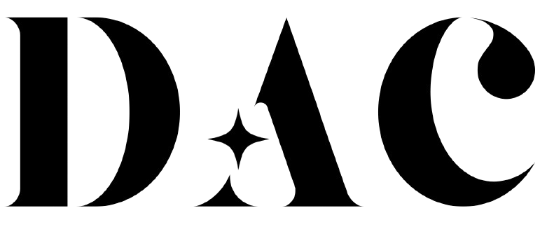

  

<h2 align="center">🛰️ DAC Summer School for Computational Astronomy 2025</h2>

  Welcome to <strong>PyAstroLab</strong>, the official GitHub organization for the 6-week summer school in computational astronomy. Hosted by the DAC initiative, this program introduces high school and undergraduate students to astronomy through the lens of Python programming.

---

## 🗓️ Course Overview (June 13 – July 20, 2025)

The program includes:
- 🐍 Python basics (NumPy, Matplotlib, Pandas)
- 🌠 Astronomical data analysis with Astropy
- 💾 FITS file handling and galaxy modeling (GALAMO)
- 🧪 Statistical methods and Monte Carlo simulations
- 🔭 SQL & data access with Astroquery
- 🔬 AGN classification using SDSS data & BPT diagrams
- 🧑‍💻 Final research mini-project using real astronomical data

Live sessions run **Friday to Sunday**, with assignments and materials shared via this organization.

---

## 📁 Repositories

Each student will receive **private repositories** for:
- Weekly assignments
- Final project submission
- Example notebooks and lecture materials

---

## 🛠️ Tech Stack
- Python 3.x
- Jupyter Notebooks
- Git & GitHub
- Astropy, GALAMO, Astroquery

---

> All content here is for educational use only and is private to enrolled students.

---
